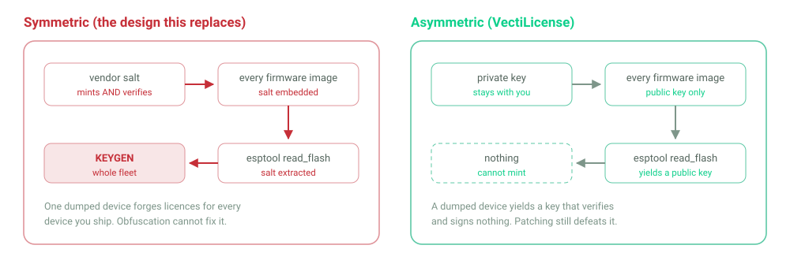
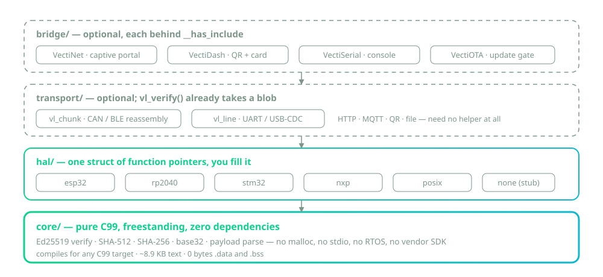
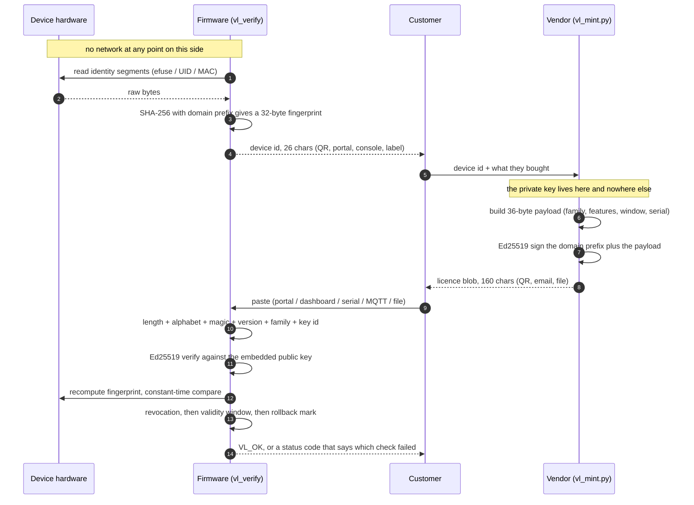

<div align="center">



# VectiLicense

**Offline device licensing for embedded products. The device holds a 32-byte Ed25519
public key and can verify a licence — it structurally cannot mint one.**

[](LICENSE)
[](#the-licence-format)
[](#portability)
[](#footprint)
[](#footprint)
[](#how-activation-actually-goes)
[](#build-and-test)


</div>

---

## 🔐 Why asymmetric — the whole point in one picture



The design this replaces was **symmetric**: the salt that verified a licence also minted
one, so it had to live in every firmware image. A single `esptool read_flash` produced a
keygen for every device the vendor would ever sell. That is not fixable by hiding the
key better — it is fixable only by not shipping it.

---

## 🧱 How it is put together




```c
vl_status_t st = vl_verify(blob, &CFG, hal, &lic);
if (st == VL_OK && vl_has_feature(&lic, FEATURE_MODBUS)) {
    enable_modbus();
}
```

A licence is a 36-byte payload plus a 64-byte Ed25519 signature, delivered as 160
Crockford-base32 characters — by QR code, captive portal, serial console, MQTT, a file
on a USB stick, or a technician's clipboard. Verification is arithmetic. There is no
network call, ever, and nothing to phone home to.

- **No keygen is possible.** Dump the firmware and you get a public key.
- **No allocation, no OS, no libc headers at all.** The core is freestanding C99 —
  `<stdint.h>` and `<stddef.h>` only. `<string.h>` is a *hosted* header, so core
  declares the three functions it calls (`memcpy`, `memset`, `memcmp`) itself. Your
  runtime must still provide those symbols; every bare-metal runtime does.
- **9.2 KB of flash, 0 bytes of static RAM**, 4.4 KB of stack at the deepest point —
  measured, not estimated. See [Footprint](#footprint).
- **Apache-2.0**, one vendored public-domain dependency (TweetNaCl's verify half).
- **What is executed here is a short list, and it is written down:**
  [What has actually been built and run](#what-has-actually-been-built-and-run). Most
  of `hal/`, all of `bridge/` and every example are *written*, not *run*.

---

## Read this before you ship

An attacker who can rewrite your firmware can patch out the branch that reads
`vl_verify()`'s result. That is not a weakness of Ed25519 or of this library — it is
what "the attacker owns the hardware" means, and it is true of FlexLM, Sentinel,
Denuvo and every other software licensing scheme ever written.

What VectiLicense v1 genuinely eliminates is the **keygen**. The previous, symmetric
design shipped the minting secret in every firmware image: one flash dump produced a
universal code generator for every unit the vendor would ever sell. That class of
attack is gone, structurally, because the secret is not in the firmware to be found.

The only real mitigation for firmware patching is a hardware root of trust — on ESP32,
**Secure Boot v2 + Flash Encryption**, which moves trust into eFuses. Without it,
licensing is a speed bump against casual copying, not a wall. With it, defeating the
check means attacking the silicon.

Nothing in this repository is described as unbreakable, uncrackable, or military-grade,
because none of those would be true. [`docs/THREAT_MODEL.md`](docs/THREAT_MODEL.md)
is the long version, and it is the most important file here.

---

## What has actually been built and run

**The only things in this repository that are actually executed are the host test suite
and the ARM cross-compile.** Compiling is not running: three MCU-family HALs now
type-check in CI, but no ARM object produced here has ever been linked into an image
or run on silicon. Everything else is source that has been read and reviewed,
in a few cases compiled by hand, and in most cases never built at all.

**Executed, as `ctest` cases:**

- **The host test suite.** Nine cases over six binaries — the SHA and RFC 8032 Ed25519
  known-answer vectors, every rejection path of `vl_verify()`, an 800-bit flip sweep, a
  64-cell HAL matrix, `vecti::License` from `bridge/vl_bridge.h`, and a mutation fuzzer
  under ASan + UBSan. `hal/posix` and `hal/none` are compiled in and exercised by it.
- **The freestanding ARM cross-compile.** `arm-none-eabi-gcc 15.2.0`, Cortex-M4 and
  Cortex-M0+, `-ffreestanding -nostdinc -Os` plus the full warning set, as the cases
  `freestanding_cortex-m4` and `freestanding_cortex-m0plus`. It compiles, and that is
  all it does: nothing links those objects into an image, and no ARM object produced
  here has ever executed.

**Linked into a real firmware image:**

- A minimal bare-metal Cortex-M image (linker script + reset vector + a `main` that
  calls `vl_compute_fingerprint()` and `vl_verify()`) links and produces a flashable
  `.bin`: **8,972 B on Cortex-M0+, 8,444 B on Cortex-M4**, 0 bytes `.data`, 44 bytes
  `.bss`. `nm` confirms `vl_verify`, `vl_ed25519_verify`, `vl_sha512_final` and
  `vl_base32_decode` are all present, so the linker kept the real crypto rather than
  garbage-collecting it. The image has still never been **executed** on silicon.

- **Linking surfaced a dependency that compiling never could.** With `-nostdlib` the
  link fails on three ARM EABI helpers:

  | symbol | needed by | why |
  |---|---|---|
  | `__aeabi_lmul` | `vl_ed25519.c` | 64-bit multiply — Ed25519 field arithmetic |
  | `__aeabi_llsr` | `vl_sha512.c` | 64-bit logical shift — SHA-512 is a 64-bit hash |
  | `__aeabi_uidiv` | `vl_base32.c` | 32-bit divide; Cortex-M0/M0+ has no divide instruction |

  These live in **libgcc**, not libc. `core/` is freestanding in the C99 sense — it
  includes no hosted headers and `__STDC_HOSTED__` is respected — but on a 32-bit core
  it does require the compiler runtime. Two of the three are unavoidable: a 32-bit CPU
  has no instruction for 64-bit multiply or shift, and Ed25519 and SHA-512 both need
  them. Every real toolchain (pico-sdk, STM32Cube, MCUXpresso, ESP-IDF) links libgcc by
  default, so this is not a practical blocker — but "freestanding" should not be read as
  "links against literally nothing", and that is why it is written down here.

**Compiled by hand, not in CI:**

- `examples/baremetal/vl_gate.c` — zero diagnostics for the host and for Cortex-M0+.
  Never linked into a firmware image, never flashed, never run on a board.
- `examples/posix/vl_activate.c` — the one thing here that has been *run* outside the
  test suite: it compiles and runs on macOS, and the keygen → issue → activate →
  re-check cycle has been exercised end to end against a locally generated key. Not
  built on Linux or on a Raspberry Pi, and not a ctest case.

**Never compiled and never run, by anybody, anywhere in this repository:**

- `hal/esp32/` — never built with a real ESP-IDF or Arduino-ESP32 toolchain. There is
  no ESP toolchain on the machine that wrote it. It is written to the documented
  ESP-IDF API and nothing has checked that claim against a header.
- `hal/rp2040/`, `hal/stm32/`, `hal/nxp/` — **now type-checked in CI, still never
  run.** Each compiles cleanly for its real target with its vendor code path *selected*
  (`-Werror -Wpedantic`): stm32 180 B on Cortex-M4, rp2040 500 B on Cortex-M0+, nxp
  204 B Kinetis / 164 B i.MX RT. RP2040 builds against stand-in pico-sdk headers, and
  the NXP lint path declares `SIM`/`OCOTP` itself with **deliberately bogus base
  addresses** — enough for a compiler to read the logic, not enough to read a fuse.
  Register offsets, flash layout and fuse semantics remain unverified until someone
  runs them on a board.

  CI asserts a **minimum object size** for each, because the first attempt at this
  reported "compiles clean" while producing a 4-byte object: every vendor `#if` was
  false, so an empty translation unit had been compiled and nothing was checked.
- `bridge/vl_bridge_ota.h`, `vl_bridge_serial.h`, `vl_bridge_net.h`,
  `vl_bridge_dash.h` — **never compiled against the real VectiOTA, VectiSerial,
  VectiNet or VectiDash.** Each is behind `__has_include`, so an uninstalled sibling
  compiles to nothing; that is exactly why nothing here has ever type-checked them.
  The Arduino-free half — `vecti::License` in `bridge/vl_bridge.h`, which is where all
  four bridges' logic actually lives — *is* compiled and tested, by
  `tests/test_vl_bridge.cpp`.
- `examples/esp32-arduino/esp32-arduino.ino` — never built, never flashed.

Expect to fix an include path on your first build of any of those. The logic is the
part worth reading, and each file repeats this warning in its own header.

The three examples ship a **placeholder public key** whose private half was generated
in memory and discarded. Nothing can sign for it, so an unmodified example refuses
every licence with `VL_ERR_BAD_SIGNATURE` — loudly, at the first activation. Paste your
own key from `vl_mint.py keygen`. Never substitute an all-zero key: 32 zero bytes are a
valid low-order curve point, and against a low-order key a signature can be forged with
no private key at all. `core/` rejects such keys outright, so this fails closed either
way, but a placeholder must be a real point to fail closed for the right reason.

---

## Portability

Three layers, strictly separated. The core knows nothing about your platform, and
`vl_verify()` takes a NUL-terminated string, so it knows nothing about your transport
either.

| Layer | Portable to | Status |
|---|---|---|
| `core/` — Ed25519 verify, SHA-256/512, base32, parse, constant-time compare | any conforming C99 target | **compile-verified**: clang (macOS arm64) `-Wall -Wextra -Werror -Wpedantic -Wconversion`; `arm-none-eabi-gcc` for Cortex-M4 and Cortex-M0+ with `-ffreestanding -nostdinc -Os` and the same warning set, as ctest cases `freestanding_cortex-m4` / `freestanding_cortex-m0plus` |
| `hal/posix/` — Linux, Raspberry Pi, macOS | POSIX hosts | **compile-verified and run** on macOS; end-to-end activation exercised |
| `hal/none/` — the documented stub to fill in | anything | **compile-verified** |
| `hal/esp32/` — efuse MAC + chip info + flash id, NVS storage, Secure Boot posture | ESP32 family | written to the ESP-IDF API. **Never built with a real ESP-IDF or Arduino-ESP32 toolchain** — there is none on the build machine |
| `hal/rp2040/` — `pico_get_unique_board_id`, flash-sector storage | RP2040 / RP2350 | written to the documented pico-sdk API. **Never compiled, never run** |
| `hal/stm32/` — `HAL_GetUIDw0/1/2`, or the raw UID base address | STM32 F0…U5, WB, WL | written to the documented Cube HAL API. **Never compiled, never run** |
| `hal/nxp/` — Kinetis `SIM->UIDx`, i.MX RT OCOTP | NXP Kinetis, i.MX RT | written to the documented MCUXpresso API. **Never compiled, never run** |
| `transport/` — optional framing for CAN/BLE/UART | anything that moves 160 characters | **compile-verified**, tested (`test_vl_transport`), and cross-compiled freestanding |
| `bridge/vl_bridge.h` — `vecti::License`, where all four bridges' logic lives | any C++11 (no Arduino) | **compiled and tested** on the host by `tests/test_vl_bridge.cpp` |
| `bridge/vl_bridge_{ota,serial,net,dash}.h` — VectiOTA / VectiSerial / VectiNet / VectiDash shims | Arduino/ESP32 | header-only, each behind `__has_include`. **Never compiled against the real sibling libraries** — not once, not anywhere here |

"Never compiled" means exactly that: the file was written against the vendor's
documented API and the machine that produced it had no SDK to build it with. Expect to
fix an include path on your first build. The logic is the part worth reading, each file
says so in its own header, and
[What has actually been built and run](#what-has-actually-been-built-and-run) is the
whole list in one place.

A board nobody has ported? Copy `hal/none/` and write one function.
[`docs/PORTING.md`](docs/PORTING.md) is a 30-minute walkthrough.

---

## Five-minute integration

**1. Generate your key.** Once, ever. On a machine you trust.

```bash
python3 tools/vl_mint.py keygen --key vendor.key --key-id 1
```

It writes `vendor.key` with mode 0600 and prints your public key as a C array, ready
to paste. Back the private key up offline. Never commit it, never put it in firmware,
never put it in CI unless CI is your signing service and the key lives in a secrets
manager.

**2. Paste the public key into your firmware** and pick a family byte:

```c
#include "vectilicense/vectilicense.h"
#include "vl_hal_esp32.h"      /* or vl_hal_posix.h, or your own */

static const vl_pubkey_t VENDOR_KEYS[] = {
    { .key_id = 1, .key = { 0x02, 0x1a, /* ...30 more, from keygen... */ } },
};
static const vl_config_t CFG = {
    .keys = VENDOR_KEYS, .key_count = 1,
    .family = 2,                       /* this product line */
    .revoked_serials = NULL, .revoked_count = 0,
    .flags = 0,
};
```

**3. Show the customer their device id.**

```c
uint8_t fp[VL_FINGERPRINT_LEN];
char id[VL_DEVICE_ID_STR_BUF_LEN];          /* 27 bytes */
if (vl_compute_fingerprint(vl_hal_esp32(), fp) == VL_OK) {
    vl_encode_device_id(fp, id, sizeof id);  /* "7V3VAR49YVAVNKKRJT0FR2RAE0" */
}
```

**4. Mint, on your machine, when they order.** No pre-generation, no per-device state,
no database required.

```bash
python3 tools/vl_mint.py issue --key vendor.key \
        --device-id 7V3VAR49YVAVNKKRJT0FR2RAE0 \
        --family 2 --features 0x0d --serial 1001 \
        --expires 2027-01-01 --qr licence.png
```

**5. Verify, on the device, wherever those 160 characters land.**

```c
vl_license_t lic;
vl_status_t st = vl_verify(blob, &CFG, vl_hal_esp32(), &lic);
if (st != VL_OK) {
    log_warn("unlicensed: %s", vl_status_str(st));
} else if (vl_has_feature(&lic, FEATURE_MODBUS)) {
    enable_modbus();
}
```

That is the whole API surface you need. Everything else — storage, the captive portal,
the QR widget, the console command — is optional.

Working code, all three deliberately different in how much they assume:

| Example | What it shows | Verified |
|---|---|---|
| [`examples/posix/`](examples/posix/vl_activate.c) | the whole loop as a CLI: device id, verify, store, re-check | **compiles and runs on macOS**; the full keygen → issue → activate → re-check cycle was exercised end to end against a locally generated key. Not run on Linux or a Pi, and not a ctest case |
| [`examples/esp32-arduino/`](examples/esp32-arduino/esp32-arduino.ino) | captive-portal activation, QR device id, `license` console command, OTA gating — every bridge behind `__has_include` | **never compiled, never flashed** — no ESP toolchain here |
| [`examples/baremetal/`](examples/baremetal/vl_gate.c) | `hal/none/` filled in for a Cortex-M with a 96-bit die id: no OS, no heap, no stdio, no clock, UART activation via `transport/vl_line.c` | **compiles**, zero diagnostics, with `-ffreestanding -Wall -Wextra -Werror` on the host and with `arm-none-eabi-gcc -mcpu=cortex-m0plus -Os -ffreestanding -nostdinc -isystem "$(arm-none-eabi-gcc -print-file-name=include)"` plus the same warning set. **Never linked, never flashed, never run**, and neither command is a ctest case |

---

## How activation actually goes



Steps 1–4 need no vendor. Steps 9–14 need no network. Only the middle — sending 26
characters and getting 160 back — involves a human, and that can be email, a web form,
a phone call, or a sticker in a box.

---

## The licence format

100 bytes on the wire, 160 characters as text.

| Offset | Size | Field | Notes |
|---|---|---|---|
| 0 | 1 | `magic` | `0x56` (`'V'`) |
| 1 | 1 | `version` | `0x01` |
| 2 | 1 | `key_id` | selects among the embedded public keys — this is how rotation works |
| 3 | 1 | `family` | product line; a licence for one family is refused by another |
| 4 | 4 | `features` | little-endian 32-bit bitmap |
| 8 | 16 | `device_id` | first 16 bytes of the SHA-256 fingerprint |
| 24 | 4 | `not_before` | LE epoch seconds, 0 = no lower bound |
| 28 | 4 | `not_after` | LE epoch seconds, 0 = perpetual |
| 32 | 4 | `serial` | for support and for the revocation list |
| 36 | 64 | `signature` | Ed25519 over `"vectilicense:v1" \|\| 0x00 \|\| payload[0..35]` |

The domain-separation prefix means a VectiLicense signature can never be replayed into
some other protocol that happens to use the same vendor key, and vice versa.

Not hand-typeable, deliberately. A 15-character code that a human can type has 75 bits
at best; that is a MAC, and a MAC needs a shared secret, and a shared secret in
firmware is the keygen we just removed. 160 characters is the price of asymmetry, and
QR codes do not mind.

---

## Footprint

Measured, on this repository, with `arm-none-eabi-gcc 15.2.0 -Os -ffreestanding`:

| | Cortex-M4 | Cortex-M0+ |
|---|---|---|
| `core/` text | 9,195 B | 9,319 B |
| `.data` + `.bss` | 0 B | 0 B |
| deepest stack chain (`-fstack-usage`) | — | 4,376 B |

The stack chain is `vl_verify` 264 → `vl_ed25519_verify` 2,544 → `scalarmult` 32 →
`add` 1,184 → `M` 304 → `car25519` 48. Size a task that calls `vl_verify()` with at
least 5 KB. One `vl_verify()` measures **2.8 ms on an Apple M1 Pro at -O2** (1,000
verifies of a valid blob, wall clock / 1,000); on a
240 MHz ESP32 expect tens of milliseconds and on a Cortex-M0+ hundreds — those two are
estimates, not measurements. Either way: call it at boot or from a work task, never
from an interrupt or a network stack's callback.

Nothing allocates. There is no static writable state anywhere in `core/`.

---

## Layout

```
include/vectilicense/   the one public header
core/                   pure C99, freestanding. <stdint.h> <stddef.h> only; the
                        memcpy/memset/memcmp prototypes live in core/vl_libc.h
hal/                    everything platform-specific, injected as a struct of
                        function pointers. esp32 rp2040 stm32 nxp posix none
transport/              optional framing: CAN/BLE chunk reassembly, UART lines
bridge/                 optional shims for VectiDash / VectiNet / VectiSerial / VectiOTA
tools/vl_mint.py        the ONLY thing that touches a private key
tests/                  known-answer vectors, every rejection path, a bit-flip
                        sweep, and a mutation fuzzer under ASan + UBSan
examples/               posix, esp32-arduino, baremetal
```

The layering is a rule, not a suggestion: `core/` includes no vendor header, no
`stdio.h`, no `time.h`, no `malloc`. Anything that talks to hardware lives behind
`vl_hal_t`, and every callback in it except the fingerprint is optional and may be
NULL. That is what makes the same object files run on an ESP32, an STM32, and your
laptop.

---

## Build and test

```bash
cmake -B build -DCMAKE_BUILD_TYPE=Release
cmake --build build -j
ctest --test-dir build --output-on-failure
```

Six test binaries and nine ctest cases: SHA-256/512 and RFC 8032 Ed25519 known-answer
vectors, the base32 codec, every rejection path of `vl_verify()`, a sweep that flips all
800 bits of a valid blob and asserts every one is refused, a 64-cell matrix over the
optional HAL callbacks, `vecti::License` from `bridge/`, a mutation fuzzer built with
`-fsanitize=address,undefined` that asserts no crash and — the precise form of "no false
accept" — that anything accepted decodes to exactly the bytes the vendor signed, and two
freestanding `arm-none-eabi-gcc` cross-compiles that run whenever that toolchain is on
`PATH`.

```bash
./build/fuzz_vl_verify 500000 12345      # a longer soak, any seed
```

---

## Documentation

- [`docs/THREAT_MODEL.md`](docs/THREAT_MODEL.md) — what this defends against, what it
  cannot, and how to enable the thing that actually helps. **Read this one.**
- [`docs/INTEGRATION.md`](docs/INTEGRATION.md) — vendor workflow, device workflow, key
  rotation, revocation, and every delivery path.
- [`docs/PORTING.md`](docs/PORTING.md) — a new MCU in under an hour.
- [`docs/API.md`](docs/API.md) — every function, every status code, every contract.
- [`transport/README.md`](transport/README.md) — which transports need a helper (two)
  and which do not (the rest).

## Licence

Apache-2.0 — see [`LICENSE`](LICENSE). Copyright 2026 VectiVolt.

Vendored: the verification half of TweetNaCl (public domain, 2014-04-27), with signing,
key generation, Salsa20, Poly1305 and Curve25519 deleted rather than disabled. Full
provenance, upstream hash and licence text are in the header of `core/vl_ed25519.c`.

Security reports: <team@vectivolt.com>. If you can make `vl_verify()` return `VL_OK`
for a blob the vendor key did not sign, we want to hear from you immediately. If you
found that patching out the call site bypasses the check — that is documented above,
on purpose, and is not a vulnerability.
